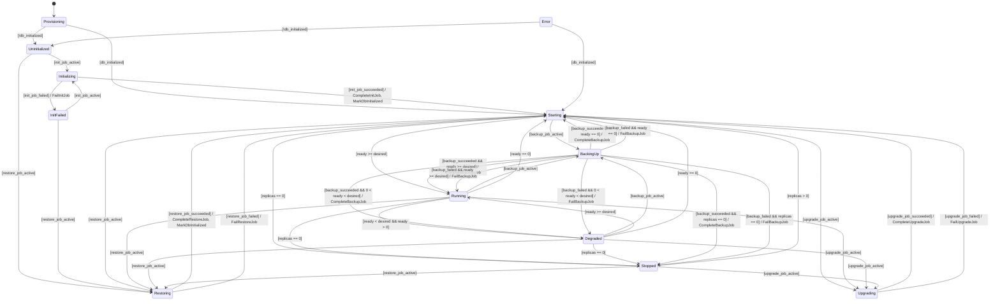

# OdooInstance State Machine

Auto-generated from the `TRANSITIONS` table in `controller/state_machine.rs`.

```mermaid
stateDiagram-v2
    [*] --> Provisioning

    Provisioning --> Uninitialized : [!db_initialized]
    Provisioning --> Starting : [db_initialized]

    Uninitialized --> Initializing : [init_job_active]
    Uninitialized --> Restoring : [restore_job_active]

    Initializing --> Starting : [init_job_succeeded] / CompleteInitJob, MarkDbInitialized
    Initializing --> InitFailed : [init_job_failed] / FailInitJob

    InitFailed --> Initializing : [init_job_active]
    InitFailed --> Restoring : [restore_job_active]

    Starting --> Stopped : [replicas == 0]
    Starting --> Restoring : [restore_job_active]
    Starting --> Upgrading : [upgrade_job_active]
    Starting --> BackingUp : [backup_job_active]
    Starting --> Running : [ready >= desired]

    Running --> Stopped : [replicas == 0]
    Running --> Restoring : [restore_job_active]
    Running --> Upgrading : [upgrade_job_active]
    Running --> BackingUp : [backup_job_active]
    Running --> Degraded : [ready < desired && ready > 0]
    Running --> Starting : [ready == 0]

    Degraded --> Stopped : [replicas == 0]
    Degraded --> Restoring : [restore_job_active]
    Degraded --> Upgrading : [upgrade_job_active]
    Degraded --> BackingUp : [backup_job_active]
    Degraded --> Running : [ready >= desired]
    Degraded --> Starting : [ready == 0]

    BackingUp --> Stopped : [backup_succeeded && replicas == 0] / CompleteBackupJob
    BackingUp --> Stopped : [backup_failed && replicas == 0] / FailBackupJob
    BackingUp --> Running : [backup_succeeded && ready >= desired] / CompleteBackupJob
    BackingUp --> Running : [backup_failed && ready >= desired] / FailBackupJob
    BackingUp --> Degraded : [backup_succeeded && 0 < ready < desired] / CompleteBackupJob
    BackingUp --> Degraded : [backup_failed && 0 < ready < desired] / FailBackupJob
    BackingUp --> Starting : [backup_succeeded && ready == 0] / CompleteBackupJob
    BackingUp --> Starting : [backup_failed && ready == 0] / FailBackupJob

    Upgrading --> Starting : [upgrade_job_succeeded] / CompleteUpgradeJob
    Upgrading --> Starting : [upgrade_job_failed] / FailUpgradeJob

    Restoring --> Starting : [restore_job_succeeded] / CompleteRestoreJob, MarkDbInitialized
    Restoring --> Starting : [restore_job_failed] / FailRestoreJob

    Stopped --> Restoring : [restore_job_active]
    Stopped --> Upgrading : [upgrade_job_active]
    Stopped --> Starting : [replicas > 0]

    Error --> Starting : [db_initialized]
    Error --> Uninitialized : [!db_initialized]
```
